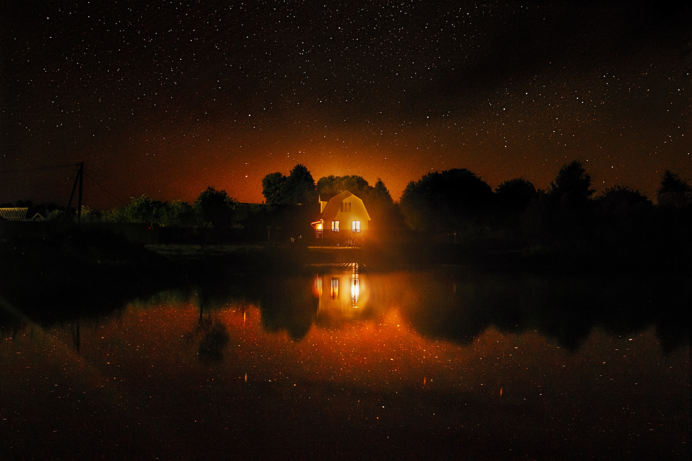

# 풀스크린 UI 프로젝트

```html
<body>
	<main>
		<h1>Mark Down</h1>
	</main>
</body>
```

```javascript
const box = document.querySelector('.box');
box.addEventListener('click', (e) => {
	e.preventDefault();
});
```



